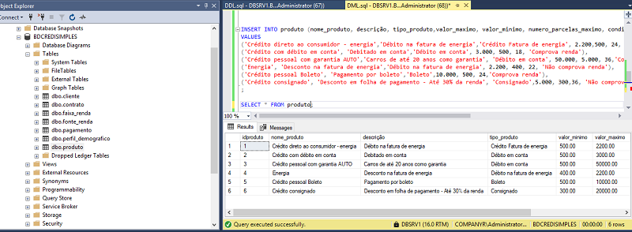

<h3>Projeto: Implementação de Database - SQL SERVER e modelagem relacional de gerenciamento de banco de dados de clientes, produtos e serviços para Financeira<h3>

Professor: Gustavo Aguilar

Disciplina: Revisão SQL 

Bootcamp Engenharia de Dados - XPeducação

Objetivos:

- Estudar integridade e consistência dos dados;
- Praticar Modelagem Relacional;
- Praticar população das tabelas;
- Praticar consultas;

Ferramentas:

- [SQL SERVER](https://www.microsoft.com/pt-br/sql-server/sql-server-downloads)   
- [SQL SERVER MANAGEMENT STUDIO(SSMS](https://learn.microsoft.com/en-us/sql/ssms/download-sql-server-management-studio-ssms?view=sql-server-ver16))
  
